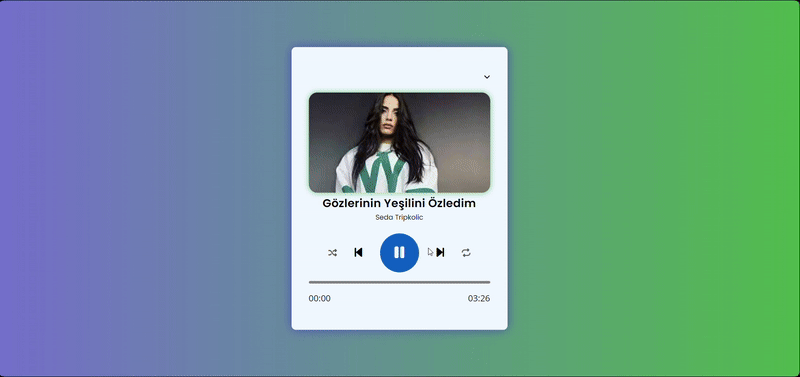

# MP3-Player

In this project, a MP3 player app was built by using HTML, CSS and Javascript.

# Features

- Users can have a dynamic experience with the next, previous, mix and shuffle buttons.
- Music list can be opened and users can choose any of them as they wish.
- Time bar allows users to choose any spesific part of the music.

# Preview

